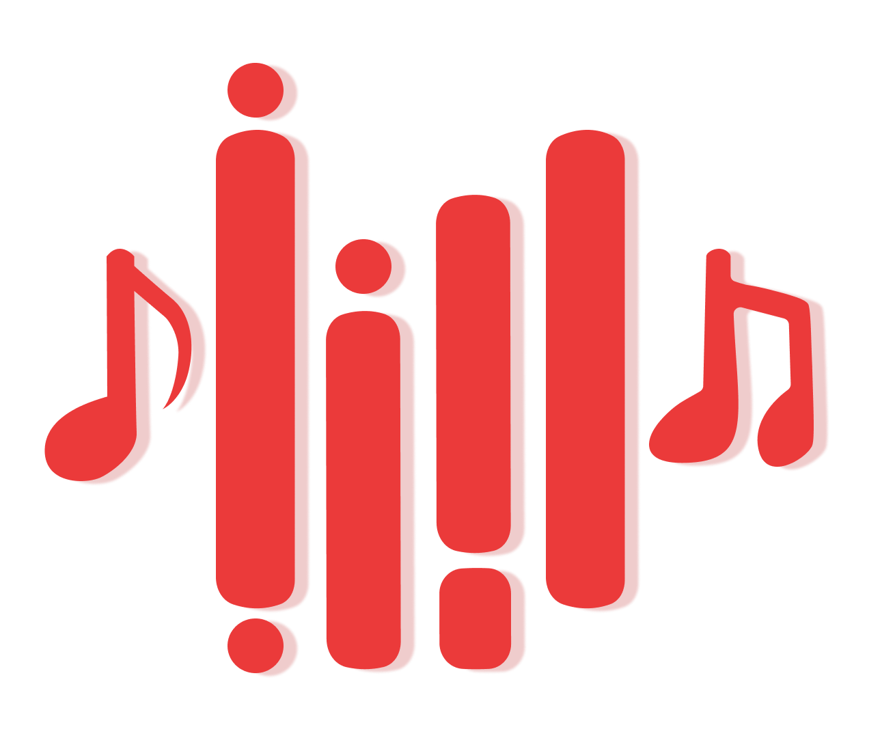

<div align="center">
  <em>Dengan rahmat tuhan yang maha Esa</em>
</div>
<hr/>
<p align="center">
  <a href="http://nestjs.com/" target="blank"></a>
</p>

[circleci-image]: https://img.shields.io/circleci/build/github/nestjs/nest/master?token=abc123def456

[circleci-url]: https://circleci.com/gh/nestjs/nest

  <p align="center">SuaraNusa backend API with NestJS framework for building efficient and scalable server-side applications.</p>
    <p align="center">
<a href="https://www.npmjs.com/~nestjscore" target="_blank"></a>
<a href="https://www.npmjs.com/~nestjscore" target="_blank"></a>
<a href="https://www.npmjs.com/~nestjscore" target="_blank"></a>
<a href="https://circleci.com/gh/nestjs/nest" target="_blank"></a>
<a href="https://coveralls.io/github/nestjs/nest?branch=master" target="_blank"></a>
<a href="https://discord.gg/G7Qnnhy" target="_blank"></a>
<a href="https://opencollective.com/nest#backer" target="_blank"></a>
<a href="https://opencollective.com/nest#sponsor" target="_blank"></a>
  <a href="https://paypal.me/kamilmysliwiec" target="_blank"></a>
    <a href="https://opencollective.com/nest#sponsor"  target="_blank"></a>
  <a href="https://twitter.com/nestframework" target="_blank"></a>
</p>
  <!--[](https://opencollective.com/nest#backer)
  [](https://opencollective.com/nest#sponsor)-->

## Description

This project is a SuaraNusa RESTful API built using NestJS, a progressive framework for Node.js. Designed with modularity and scalability in mind, it provides a clean structure for developing server-side applications. Leveraging the power of TypeScript, it ensures type safety and robust code practices.

The API includes functionalities for handling CRUD operations, input validation, authentication, and seamless database integration. It is suitable for projects requiring efficient communication between client and server while maintaining security and reliability.
## Pre Requirement

1. Yarn Package Manager
2. MySQL/Database
3. NestJS
4. NodeJS
   
## Library/Tools Used
1. TypeScript
2. Zod Validation
3. Axios
4. Passport
5. JWT
6. NestJS
7. Winston
8. UUID
9. YoutubeSR
10. BCrypt
    
## Installation

```bash
# 
$ yarn
$ npx prisma migrate dev

```

## Running the app

```bash
# development
$ nest start

# watch mode
$ nest start -w

```


## Support

Nest is an MIT-licensed open source project. It can grow thanks to the sponsors and support by the amazing backers. If
you'd like to join them, please [read more here](https://docs.nestjs.com/support).

## Stay in touch

- Author - [Aditya Alfarezy Damanik](linkedin.com/alfarezyyd)
- GitHub - [https://github.com/alfarezyyd](https://github.com/alfarezyyd)

## License

SuaraNusa Backend-API is [MIT licensed](LICENSE).
